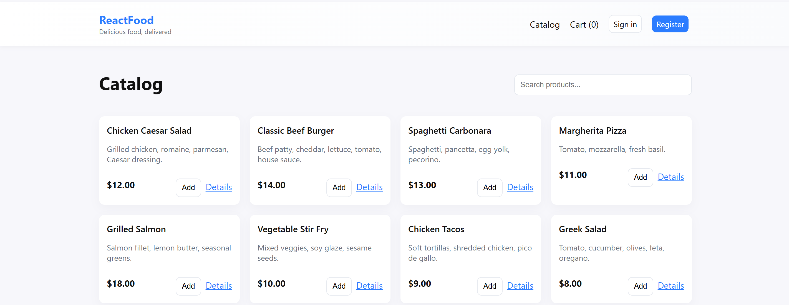
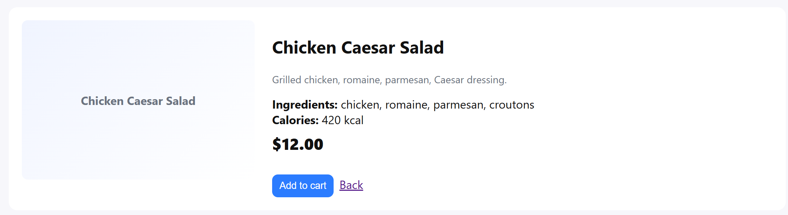
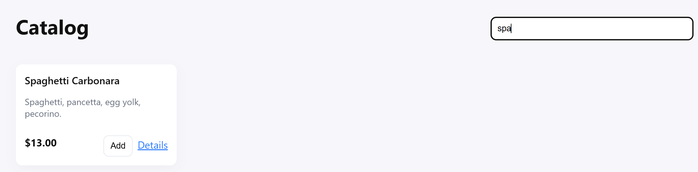

# ReactFood — Catalog & Checkout App 🍔🥗

## 📝 Description
ReactFood is a simple demo food store built with React + TypeScript.  

Users can:  
- Browse a catalog of dishes;  
- Add items to the cart;  
- Perform a minimal checkout;  
- Register and log in (with email/password validation).  

---

## ✨ Features

- Catalog page: grid of products, search bar, "Add to Cart" button.  
- Product detail page: dish details, ingredients, calories.  
- Cart page: view items, remove, clear cart, total summary.  
- Checkout page: form with name, email, phone, address, card details (mock).  
- Authentication: registration, login, user stored in localStorage.  
- Form validation: email, password, required fields, mock card validation.  

---

## 🖼 Screenshots
 
 
 
 
 
 

## 🛠 Tech Stack

- React 18 + TypeScript  
- React Router DOM  
- Context API (cart & auth)  
- UUID (for order ID)  
- CSS variables, Flexbox & Grid layouts  

## ⚡️ Usage

1. Open the app in your browser.  
2. Add items to the cart.  
3. Go to Cart and click Checkout.  
4. Fill out the form and click Pay.  
5. After successful checkout, you’ll see the order summary page.  

## ✅ Form Validation

- Email: format user@example.com  
- Password: minimum 6 characters, letters + numbers  
- Required fields: Name, Email, Address  
- Card: minimum 12 digits (mock validation)  

## ⚠️ Notes

- Payment is demo only, no real transactions.  
- Cart and user are stored in localStorage.  
- No backend; all data is stored locally.
