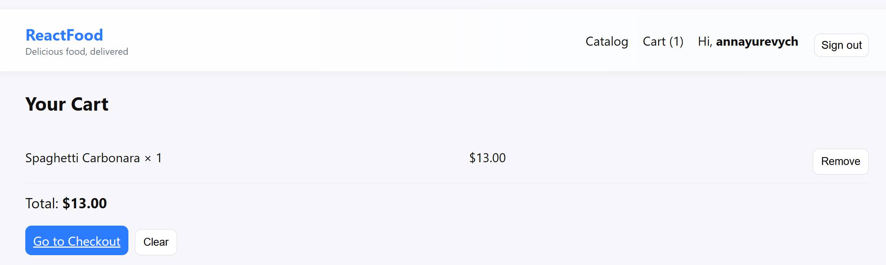
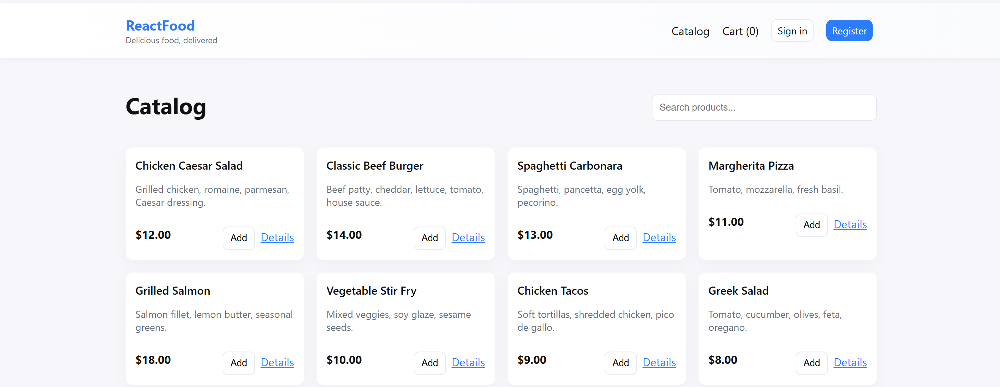
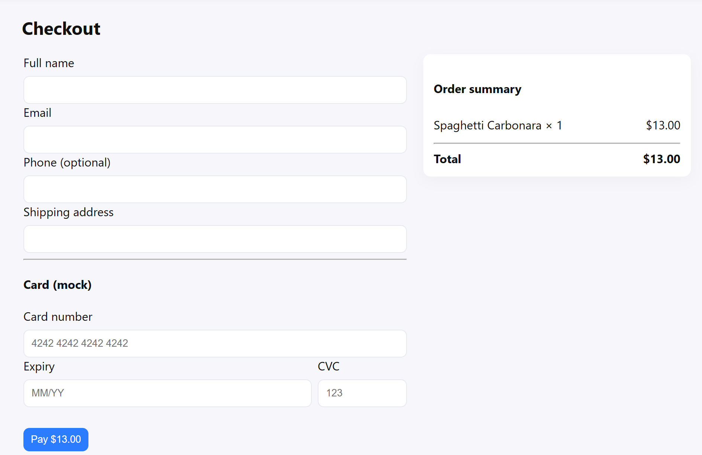
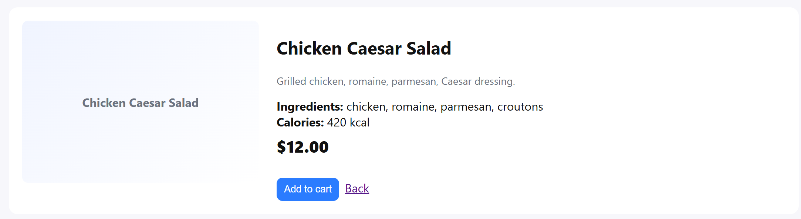
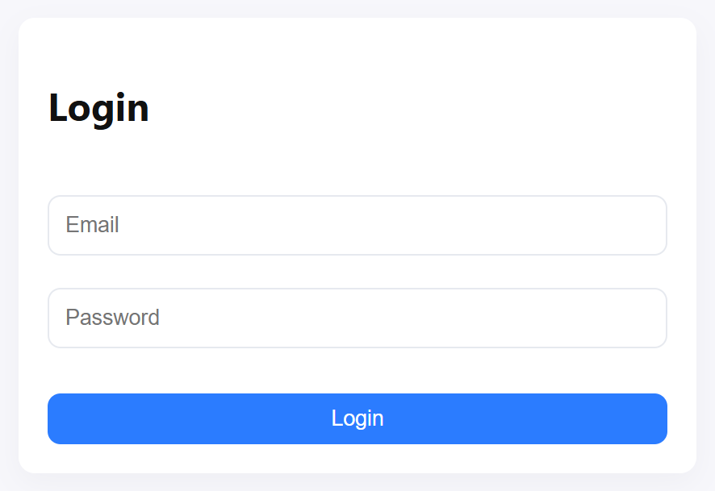
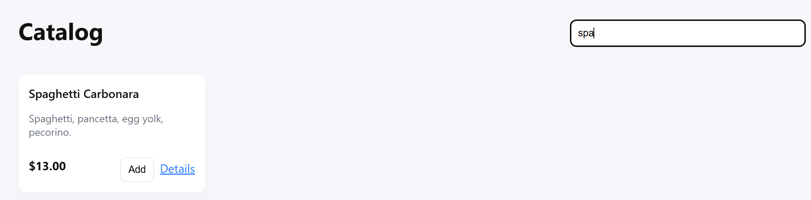

# ReactFood — Catalog & Checkout App 🍔🥗

## 📝 Description
**ReactFood** is a fullstack food store application built to demonstrate modern web development practices. It features a separate frontend and a backend server.

Users can:  
- Browse a live product catalog fetched from the server;  
- Add items to the persistent cart;  
- Perform a checkout with real-time order processing on the backend;  
- Register and log in.

---

## 🚀 Deployment

- **Frontend (UI):** [https://reactfood-fawn.vercel.app](https://reactfood-fawn.vercel.app) — hosted on Vercel.
- **Backend (API):** [https://reactfood-api.onrender.com/api/products](https://reactfood-api.onrender.com/api/products) — hosted on Render.

---

## ✨ Features

- **Frontend:** React application with complex state management and routing.
- **Backend API:** Custom-built REST API using Nest.js to handle products and orders.
- **Cross-Origin Resource Sharing (CORS):** Properly configured communication between client and server.
- **Search & Filtering:** Real-time catalog filtering. 

---

## 🖼 Screenshots
 
 
 
 
 
 

## 🛠 Tech Stack

### Frontend:
- **React 18** + **TypeScript**  
- **React Router DOM**  
- **Context API** (cart & auth)  

### Backend:
- **Node.js** + **Nest.js**
- **TypeScript**
- **RESTful API** design

## ⚡ Usage

1. Open the app in your browser.  
2. Add items to the cart.  
3. Go to **Cart** and click **Checkout**.  
4. Fill out the form and click **Pay**.  
5. After successful checkout, you’ll see the order summary page.  

## ✅ Form Validation

- **Email:** format `user@example.com`  
- **Password:** minimum 6 characters, letters + numbers  
- **Required fields:** Name, Email, Address  
- **Card:** minimum 12 digits (mock validation)  

## ⚠️ Notes

- Payment is demo only, no real transactions.  
- Cart and user are stored in **localStorage**.  
- No backend; all data is stored locally.  
